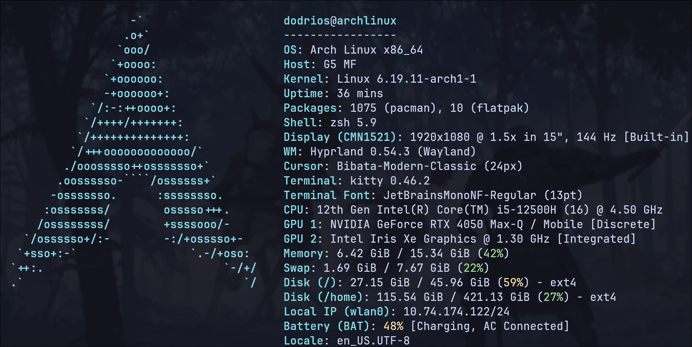
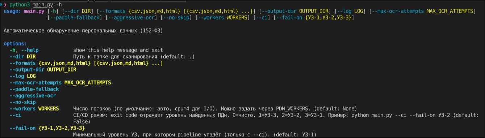

<div align="center">

  
  
  <h1>pizza_assorted</h1>
  
  <p><strong>Автоматический сканер и классификатор персональных данных по 152-ФЗ</strong></p>

  <p>
    <a href="https://github.com/dodrioss/pizza_assorted/tree/test_2">
      
    </a>
    
    
    
    
    
  </p>

 


</div>

---

## Что такое pizza_assorted

**pizza_assorted** — это быстрый, точный и удобный инструмент для поиска, извлечения и классификации **персональных данных (ПДн)** в файловых хранилищах.

Утилита рекурсивно обходит директории, извлекает текст из множества форматов и с высокой точностью обнаруживает:

- Паспортные данные РФ
- ИНН, СНИЛС, ОГРН
- Номера банковских карт (с проверкой алгоритма Луна)
- Телефоны, Email, почтовые адреса
- И другие виды ПДн

На основе найденных данных автоматически определяется **уровень защищённости информации (УЗ-1, УЗ-2, УЗ-3, УЗ-4)** в соответствии с требованиями **Федерального закона № 152-ФЗ**.

Идеально подходит для аудита ИС, предпроверочных мероприятий, интеграции в CI/CD и регулярного compliance-контроля.

---

## ✨ Ключевые возможности

| Функция                          | Статус | Описание |
|----------------------------------|--------|----------|
| Поддержка 20+ форматов файлов    | ✅     | PDF, DOCX, XLSX, CSV, Parquet, изображения, HTML и др. |
| Продвинутый многоядерный OCR     | ✅     | Tesseract + EasyOCR + PaddleOCR с умным fallback |
| Валидация с контрольными суммами | ✅     | Алгоритм Луна, проверка СНИЛС/ИНН и др. |
| Автоматический расчёт УЗ         | ✅     | Согласно методике 152-ФЗ |
| Высокая многопоточность          | ✅     | До 16+ работников |
| Умный пропуск обработанных файлов| ✅     | Экономит время при повторных запусках |
| Многоформатные отчёты            | ✅     | JSON, CSV, Markdown (HTML — скоро) |
| Режим CI/CD                      | ✅     | `--ci --fail-on УЗ-2` |

---

##  Быстрый старт

### Клонирование репозитория

```bash
git clone https://github.com/dodrioss/pizza_assorted.git
cd pizza_assorted
git checkout test_2
```

### Запуск

```bash
# Простой запуск (сканирует текущую папку)
python main.py

# Полноценное сканирование с отчётами
python main.py --dir ./data --formats csv json md --workers 8

# Максимальная точность распознавания
python main.py --dir /storage --aggressive-ocr --paddle-fallback

# Режим для CI/CD
python main.py --dir /important/docs --ci --fail-on УЗ-2 --formats json
```

### 🔥 Рекомендуемые команды

```bash
# Максимальная производительность
python main.py --dir /big_share --workers 16 --no-skip

# Аудит перед проверкой регулятора
python main.py --dir /critical --aggressive-ocr --formats json md
```

---

## 📋 Доступные флаги командной строки



---

## 🛠 Технологии

- **Python 3.9+**
- **OCR-движки:** Tesseract, EasyOCR, PaddleOCR
- **Библиотеки:** pypdf, python-docx, openpyxl, pytesseract, concurrent.futures
- Красивый вывод в консоль через **Rich**

---

<div align="center">
  <p>Готов к использованию в продакшене и аудитах</p>
  <a href="https://github.com/dodrioss/pizza_assorted">
    
  </a>
  <p>С любовью к чистым данным и вкусной пицце 🍕</p>
  <sub>Автор: dodrioss &nbsp;|&nbsp; Лицензия: MIT</sub>
</div>
